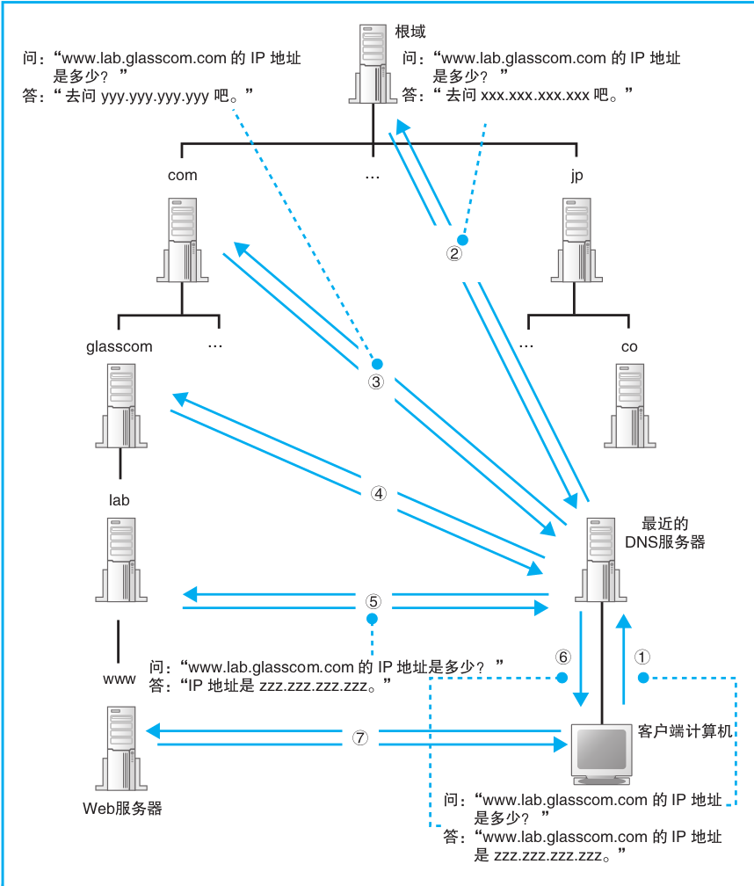

解析器查询 IP 地址本质上也是向 DNS 服务器发送请求消息. 当然也需要服务器的 IP 和 端口. 只不过这个 IP 作为 TCP/IP 的一个设置项目开机是已经设置好了, 端口则是默认的 53. 域名解析器准备好所需的信息后, 委托给传输层 UDP 协议进行传输. DNS 服务器按照域名以层次结构来组织, 上级保管着下级的信息, 除此之外每台DNS服务器都保存着根域的信息. 查询的过程大概如图所示:

  
   
   

