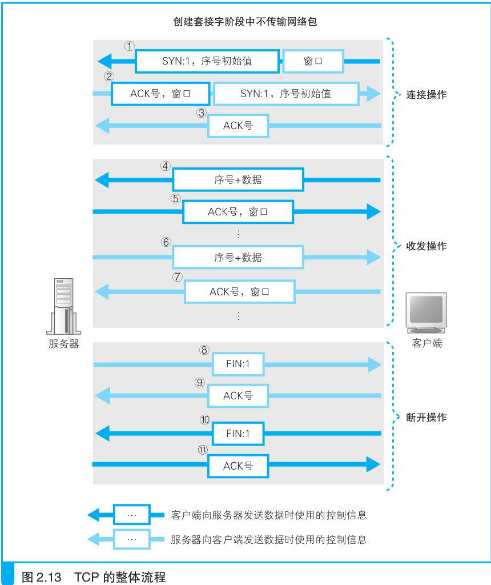

TCP 协议想要解决的一个问题就是双向通信, 也就是也就是双方都是发送方和接收方. 这就需要双方都知道彼此的 IP 和端口号. 在通信开始之前, 客户端知道通信双方的 IP 和端口号, 但是服务器却不知道. 另一个需要解决的问题是改变 UDP 这种只要有一个包丢失, 就要重发的低效特性, 使得通信变得更为可靠. 为此通信正式开始之前, 客户端和服务器准备好所需要的通信控制信息. 这个阶段称为连接阶段, 经历了"三次握手".

* 第一次握手(SYN=1, seq=x):
    
   客户端发送一个 TCP 的 SYN 标志位置1的包，指明客户端打算连接的服务器的端口，以及初始序号 X,保存在包头的序列号(Sequence Number)字段里。

   发送完毕后，客户端进入 `SYN_SEND` 状态。
   
* 第二次握手(SYN=1, ACK=1, seq=y, ACKnum=x+1):
    
   服务器发回确认包(ACK)应答。即 SYN 标志位和 ACK 标志位均为1。服务器端选择自己 ISN 序列号，放到 Seq 域里，同时将确认序号(Acknowledgement Number)设置为客户的 ISN 加1，即X+1。 
   发送完毕后，服务器端进入 `SYN_RCVD` 状态。

* 第三次握手(ACK=1，ACKnum=y+1)
   
   客户端再次发送确认包(ACK)，SYN 标志位为0，ACK 标志位为1，并且把服务器发来 ACK 的序号字段+1，放在确定字段中发送给对方，并且在数据段放写ISN的+1
   
   发送完毕后，客户端进入 `ESTABLISHED` 状态，当服务器端接收到这个包时，也进入 `ESTABLISHED` 状态，TCP 握手结束。
   
三次握手的过程的示意图如下：

连接创建好了, 则进入通信阶段. 应用程序调用 write(), 把数据交给协议栈发送, 读取数据则是 read() 函数. 一般 web 服务器在知道客户端已经接收到全部相应后, 调用 close() 进入断开阶段. 断开则经历了"四次挥手". 

* 第一次挥手(FIN=1，seq=x)
   
   假设客户端想要关闭连接，客户端发送一个 FIN 标志位置为1的包，表示自己已经没有数据可以发送了，但是仍然可以接受数据。
   
   发送完毕后，客户端进入 `FIN_WAIT_1` 状态。
   
* 第二次挥手(ACK=1，ACKnum=x+1)
    
   服务器端确认客户端的 FIN 包，发送一个确认包，表明自己接受到了客户端关闭连接的请求，但还没有准备好关闭连接。
   
   发送完毕后，服务器端进入 `CLOSE_WAIT` 状态，客户端接收到这个确认包之后，进入 `FIN_WAIT_2` 状态，等待服务器端关闭连接。
   
* 第三次挥手(FIN=1，seq=y)

   服务器端准备好关闭连接时，向客户端发送结束连接请求，FIN 置为1。
   
   发送完毕后，服务器端进入 `LAST_ACK` 状态，等待来自客户端的最后一个ACK。
   
* 第四次挥手(ACK=1，ACKnum=y+1)
    
   客户端接收到来自服务器端的关闭请求，发送一个确认包，并进入 `TIME_WAIT `状态，等待可能出现的要求重传的 ACK 包。
   
   服务器端接收到这个确认包之后，关闭连接，进入 `CLOSED` 状态。
   
   客户端等待了某个固定时间（两个最大段生命周期，2MSL，2 Maximum Segment Lifetime）之后，没有收到服务器端的 ACK ，认为服务器端已经正常关闭连接，于是自己也关闭连接，进入 `CLOSED` 状态。
        
四次挥手的示意图如下：

这个是完整示意图:

  

SYN=1 表示连接阶段, FIN=1 表示断开阶段.
SEQ(sequence number) 表示这个包的数据的第一个字节是总数据的第几个字节. 
ACK(Acknowledgement Number) 表示这个数之前的数据都收到了.
Window 表示发送方缓冲区还可容纳的数据.

TCP三次握手的第三次的 ACK 包丢失会怎样?

服务端: 第三次的 ACK 在网络中丢失, 那么服务端的 TCP 连接状态为 SYN_RECV, 并且会根据 TCP 的超时重传机制, 会等待 3 秒, 6 秒, 12 秒后重新发送 SYN+ACK 包, 以便客户重新发送 ACK 包. 如果重发指定次数之后, 仍然未收到客户端的 ACK 应答, 那么一段时间后, 服务端自动关闭这个连接.

客户端: 在 linux 中客户端一般是通过 connect() 函数来连接服务器的, 而 connect()是在 TCP 的三次握手的第二次握手完成后就成功返回值. 也就是说客户端第二次握手的包后它的 TCP 连接状态就为 established 表示该连接已经建立. 那么如果第三次握手中的 ACK 包丢失的情况下, 客户端向服务端端发送数据, 服务端将以 RST 包响应, 方能感知到服务端的错误.
